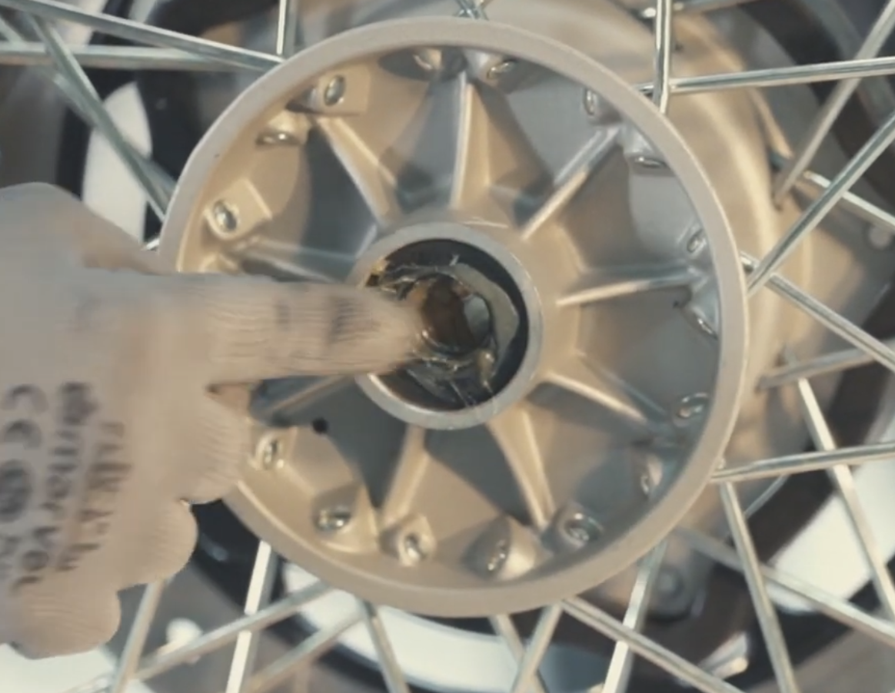

---
tags:
  - classic-350-reborn
  - обслуживание
aliases:
  - front axel greasing
---

# Смазка передней оси

## Требуемые инструменты

- Г-образный шестигранник на 6 мм.
- Рожковый гаечный ключ на 17 мм.
- Накидной гаечный ключ на 24 мм.
- [[../Инструменты/Удлинительная трубка|Удлинитель]].
- [[../Инструменты/Универсальный домкрат|Универсальный домкрат]].
- Киянка/молоток (опционально).

## Требуемые расходники

- [[../Расходники/Универсальная автомобильная смазка|Универсальная смазка]].

## Ограничения

1. Не класть колесо тормозным диском вниз.
2. Не использовать передний тормоз, если колесо снято со ступицы.

## Порядок действий

1. [[Снятие и установка переднего колеса|Снять переднее колесо]].
2. Нанести [[../Расходники/Универсальная автомобильная смазка|смазку]] на сальник и подшипник:
   

   
   
   

3. Нанести слой [[../Расходники/Универсальная автомобильная смазка|смазки]] на шпиндель (по всей длине):
   ![[attachments/Screenshot_2026-02-14_000185.png]]
4. Выполнить [[Снятие и установка переднего колеса|установку переднего колеса]].

---

[Transform Your Classic 350: Front Axle Greasing Made Easy](https://www.youtube.com/watch?v=IZN3rOfQwFk&list=PLT1BEDU54E1QNhNm0RBd0BGXzAH1leldc&index=10).