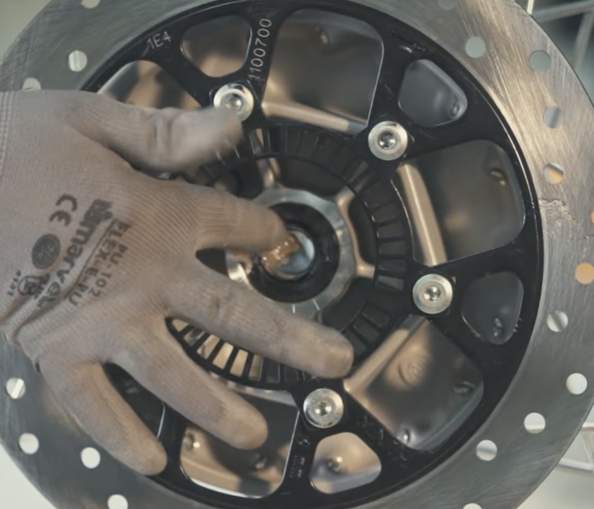

---
tags:
  - J-серия
  - обслуживание
aliases:
  - rear axle greasing
---

# Смазка задней оси

## Требуемые инструменты

- Г-образный шестигранник на 6 мм.
- Накидной гаечный ключ на 24 мм.
- [[../Инструменты/Удлинительная трубка|Удлинитель]].
- [[../Инструменты/Крестовая отвёртка|Крестовая отвёртка]].
- Киянка/молоток.

## Требуемые расходники

- [[../Расходники/Универсальная автомобильная смазка|Универсальная смазка]].

## Ограничения

1. Дать глушителю остыть перед выполнением операции.
2. Не класть колесо тормозным диском вниз.
3. Не использовать задний тормоз, когда заднее колесо снято с мотоцикла.

## Порядок действий

1. [[Снятие и установка заднего колеса|Снять заднее колесо]].
2. Нанести [[../Расходники/Универсальная автомобильная смазка|смазку]] на сальник и подшипник:
   

   
   
   

3. Нанести равномерный слой смазки на шпиндель.
4. [[Снятие и установка заднего колеса|Установить заднее колесо]].

---

[All New Classic 350 DIY | REAR AXLE GREASING](https://www.youtube.com/watch?v=lFuUgiuZLdE&list=PLT1BEDU54E1QNhNm0RBd0BGXzAH1leldc&index=9).